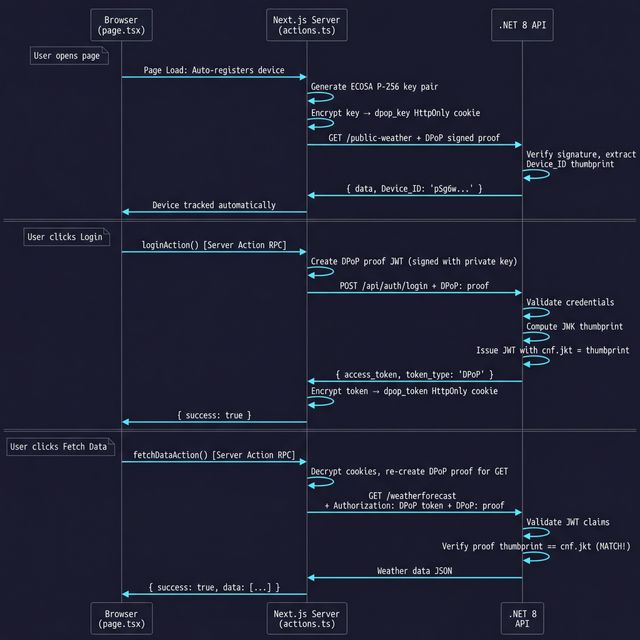

# 🛡️ DPoP Security Architecture

Welcome! This project demonstrates one of the most advanced security patterns on the web today: **DPoP (Demonstrating Proof-of-Possession)** combined with a **BFF (Backend-For-Frontend)**.

If you are new to cybersecurity, don't worry. This guide will explain exactly how it works in simple terms.

---

## 🔑 The Problem: Bearer Tokens are like Cash

Most websites today use "Bearer Tokens" (usually a JWT) to keep you logged in. Think of a Bearer Token like a **$100 bill**. 
* Whoever holds the $100 bill gets to spend it.
* If a hacker breaks into your browser and steals your token, they can send it to the server from *their* computer. The server sees the token, assumes they are you, and lets them in.

This is a massive security risk known as **Token Theft via XSS (Cross-Site Scripting)**.

## 💳 The Solution: DPoP is like a Credit Card

**DPoP** fixes this by turning your token from cash into a **Credit Card**. 
Even if a hacker steals your Credit Card (the token), they cannot use it because they don't know your specific **PIN code** (your Private Key).

Every time your device wants to talk to the server, it has to do a complex mathematical equation using its Private Key. The server checks the math. If the math fails, the server rejects the request. A hacker can steal your token, but they cannot steal your Private Key—so their math will always fail.

---

## 🛠️ Step-by-Step: How It Actually Works

We use two servers to make this magic happen:
1. **The Frontend (Next.js):** Acts as your personal bodyguard.
2. **The Backend (.NET 8):** The secure vault holding the data.

### 🎭 Scenario A: Without Login (Anonymous Device Tracking)

Even if a user never types a password, we want to cryptographically track their device to prevent spam or bots.

1. **The Handshake:** The moment a user visits the site, the Next.js bodyguard silently generates a brand new `dpop_key` (Your Physical Identity / Private Key). 
2. **The Request:** When fetching public data (like weather), Next.js uses your Private Key to mathematically sign a "Proof" that says *"I am this specific device requesting the weather"*.
3. **The Vault (.NET):** The .NET vault receives the request and the Proof. It verifies the math, extracts your device's unique "Thumbprint", and permanently remembers your device. It lets you see the public data.

### 🔐 Scenario B: With Login (Authenticated User)

When you decide to log in, we need to prove *who* you are, not just what device you are on.

1. **Logging In:** You type your username and password. Next.js sends them to the .NET vault, along with a Proof signed by your Private Key.
2. **The Superglue:** The .NET vault checks your password. It then generates an **Access Badge** (`dpop_token`). It takes the Thumbprint of your Private Key and physically superglues it into the Access Badge. It sends the badge back to Next.js.
3. **Fetching Private Data:** You click "Fetch Data". Next.js sends *both* your Access Badge and a fresh Proof signed by your Private Key to the vault.
4. **The Final Lock:** The .NET vault checks the Access Badge. It sees the Thumbprint superglued inside. It then checks your live mathematical Proof. **If the Thumbprint in the Badge perfectly matches the Proof you just generated**, the vault opens and gives you the private data.

If a hacker steals your Access Badge and tries to use it from their computer, their computer doesn't have your Private Key. They cannot generate the matching Proof, and the vault instantly kicks them out!
