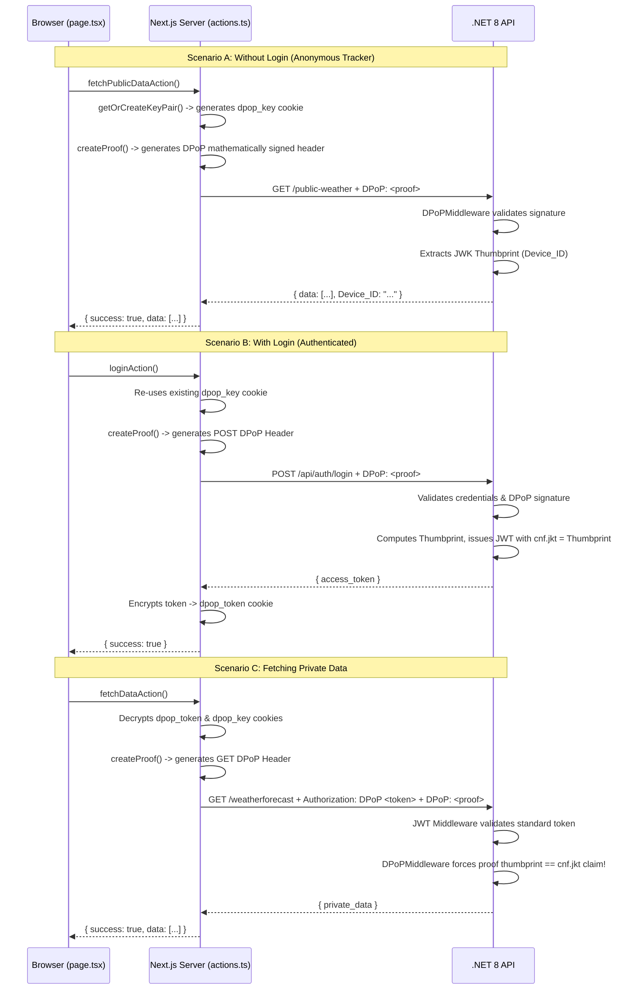

# DPoP Architecture — Code Walkthrough

This document breaks down the exact code implementations that make the DPoP and BFF architecture possible. 

---

## 🏗️ Architecture Flow Diagram

Below is the complete sequence of how Next.js handles cryptographic logic so the browser doesn't have to.

---

## 💻 1. The Frontend (Next.js BFF)

All heavy lifting occurs specifically within Server Actions in the Next.js `frontend`.

### `actions.ts` — The Central Security Hub
This file forces all external API calls to wrap through `backendFetch()`.

*   **`getOrCreateKeyPair()`**: Checks the `dpop_key` cookie. If it does not exist, it uses Node's Web Crypto API `crypto.subtle.generateKey` to mint a P-256 curve ECDSA Keypair. It encrypts the private key and stores it as an `HttpOnly` cookie.
*   **`createProof()`**: Creates the actual `DPoP` JWT signature header. It injects the HTTP method (`htm`) and the URL (`htu`), appending a timestamp (`iat`) and a unique ID (`jti`) to prevent hackers from recording and replaying the same proof later.
*   **`backendFetch()`**: The holy grail of our pattern. It wraps the standard `fetch()` command to automatically snag the device's Private Key, generate a `createProof()`, and staple the `DPoP` header to whatever outbound request is being made.

### `lib/session.ts` — Iron Session
Tokens and Private Keys are never sent raw. We use `iron-session` and the `COOKIE_SECRET` environment variable to wrap the data in AES-256-GCM encryption. Even if intercepting network traffic, these cookies appear as random garbage strings (`Fe26.2*...`).

### `page.tsx` — The UI
The entire React UI is completely oblivious to the security operations. It calls functions like `fetchDataAction()` with zero parameters. Because everything is handled server-side, it is mathematically impossible for an XSS attack to steal tokens or keys from the browser UI.

---

## 🛡️ 2. The Backend (.NET 8)

The backend never issues raw tokens; it verifies signatures on every single step.

### `AuthController.cs` — The Binding Phase
When a login request hits the server:
1. It validates the user's password.
2. It looks at the incoming `DPoP` header and extracts the user's Public Key.
3. It creates an RFC 7638 standard **Thumbprint** of that Public Key.
4. It mints the Access token (JWT) and adds the critical **`cnf.jkt` claim** matching the thumbprint. 

### `DPoPMiddleware.cs` — The Verification Engine
This acts as a transparent gatekeeper pipeline for every request.
1. **The Parsing:** It intercepts any request heading to a `.RequireAuthorization()` endpoint (and public endpoints optionally).
2. **The Fingerprint Check:** It calculates the Thumbprint from the live `DPoP` header on the current request.
3. **The Matching:** It reads the `cnf.jkt` superglue claim from the Access Token.
4. **The Math:** If the live Thumbprint doesn't match the superglue claim, or the math signature doesn't align with the URL being hit, it flags it as an impersonation attempt.

Instead of crashing or hard-failing (throwing a 401 Unauthorized), the middleware dynamically injects `HttpContext.Items["DPoP_Valid"]` and `HttpContext.Items["DPoP_Thumbprint"]`. This brilliant adjustment ensures that completely **anonymous web traffic** can still be cryptographically tracked per-device via `/public-weather` endpoints, even if no user is technically logged in!
