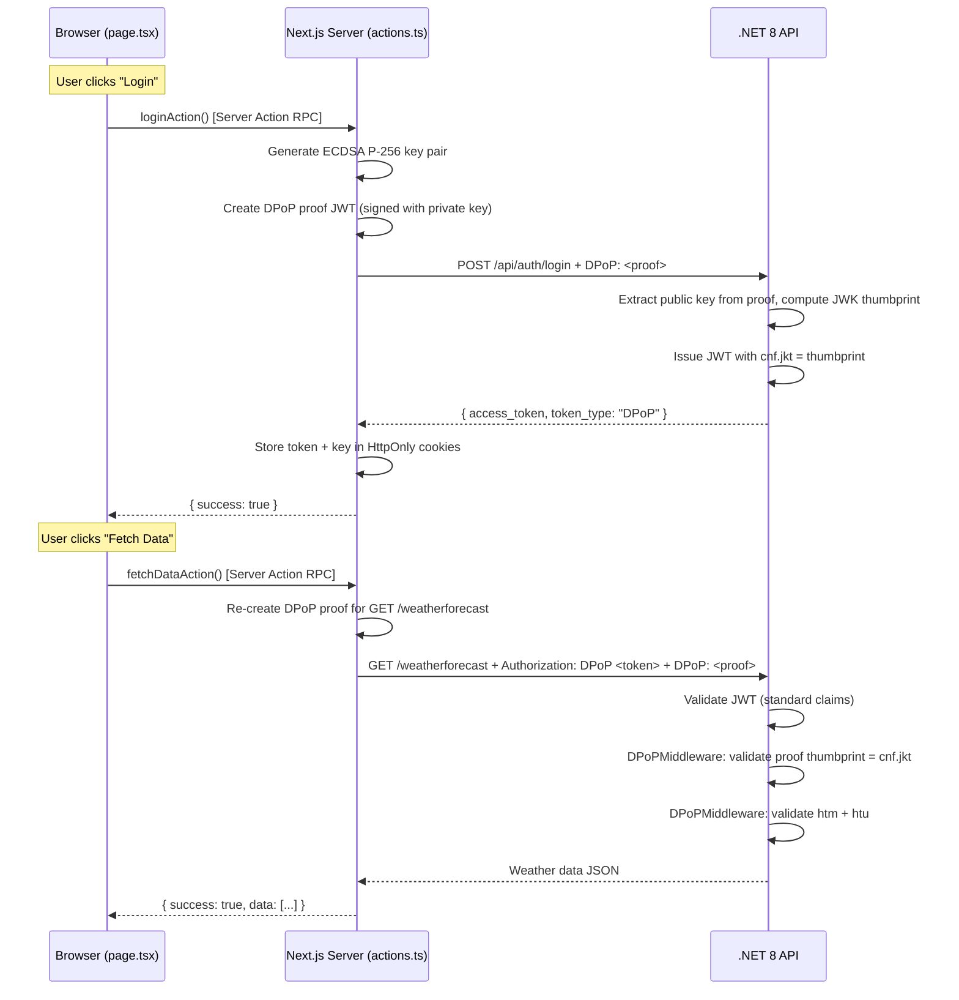

# DPoP Security Architecture — Full Code Walkthrough

## What is DPoP?

**DPoP (Demonstrating Proof-of-Possession)** is an OAuth 2.0 extension ([RFC 9449](https://datatracker.ietf.org/doc/rfc9449/)) that cryptographically **binds** an access token to a specific client's key pair. Unlike a regular Bearer token (which anyone can use if stolen), a DPoP-bound token is useless without the matching private key.

This project implements DPoP with the **Backend-For-Frontend (BFF)** pattern:



> [!IMPORTANT]
> The browser **never** touches the private key, the access token, or any DPoP proof. All cryptographic operations happen on the Next.js server. This is the core security benefit of the BFF pattern.

---

## File-by-File Breakdown

### 1. Frontend UI — [page.tsx](file:///c:/Users/pawan/Project/Security/frontend/src/app/page.tsx)

This is the **only client-side code**. It is deliberately simple — it knows nothing about tokens or keys.

| Lines | What it does |
|-------|-------------|
| `1` | `"use client"` — marks this as a React Client Component (runs in browser) |
| `4` | Imports [loginAction](file:///c:/Users/pawan/Project/Security/frontend/src/app/actions.ts#67-108) and [fetchDataAction](file:///c:/Users/pawan/Project/Security/frontend/src/app/actions.ts#109-146) — these are **Server Actions**, meaning they execute on the Node.js server, not in the browser |
| `7-8` | React state for activity logs and login status |
| `14-31` | [handleLogin](file:///c:/Users/pawan/Project/Security/frontend/src/app/page.tsx#14-32) — calls [loginAction()](file:///c:/Users/pawan/Project/Security/frontend/src/app/actions.ts#67-108) via RPC. The browser sends a POST to the Next.js server; Next.js runs the function server-side and returns the result. The browser only sees `{ success: true }` |
| `33-48` | [handleFetchData](file:///c:/Users/pawan/Project/Security/frontend/src/app/page.tsx#33-49) — same pattern. Calls [fetchDataAction()](file:///c:/Users/pawan/Project/Security/frontend/src/app/actions.ts#109-146), which runs entirely on the server |
| `50-91` | JSX render: two buttons + a log panel. The "Fetch Data" button is disabled until logged in |

**Security insight:** The browser has zero access to any secret. Even if an XSS attack executes JavaScript in this page, it cannot read the DPoP key or access token because they live in `HttpOnly` cookies that JavaScript cannot access.

---

### 2. BFF Server Actions — [actions.ts](file:///c:/Users/pawan/Project/Security/frontend/src/app/actions.ts)

This is the **security core** of the frontend. Every function here runs on the Next.js Node.js server.

#### [getOrCreateKeyPair()](file:///c:/Users/pawan/Project/Security/frontend/src/app/actions.ts#6-41) (Lines 7–40) — Key Management

```
Private key stored in HttpOnly cookie "dpop_key" as serialized JWK
```

| Lines | What it does |
|-------|-------------|
| `8-9` | Reads the `dpop_key` cookie to check if a key already exists |
| `11-19` | If a key exists: parse the JWK JSON and reconstruct the `CryptoKey` using `importJWK(jwk, 'ES256')`. Falls through to regenerate on error |
| `23-27` | If no key exists: generate a fresh **ECDSA P-256** key pair using the Web Crypto API. The `true` parameter makes it extractable (necessary so we can serialize it to a cookie) |
| `29` | Export the **private** key to JWK format for storage |
| `32-37` | Store the serialized private JWK in an `HttpOnly`, `Secure`, `SameSite=Strict` cookie |
| `39` | Return the `CryptoKey` (for signing) and the **public** JWK (for embedding in proofs) |

> [!WARNING]
> In production, the cookie containing the private key should be **encrypted** (e.g., using JWE or Iron Session). Storing a raw JWK in a cookie, even HttpOnly, is a demo simplification.

#### [createProof()](file:///c:/Users/pawan/Project/Security/frontend/src/app/actions.ts#42-66) (Lines 43–65) — DPoP Proof Generation

This builds a **DPoP proof JWT** per [RFC 9449 §4.2](https://datatracker.ietf.org/doc/html/rfc9449#section-4.2):

| Lines | What it does |
|-------|-------------|
| `44` | `jti` — a unique random ID for this proof (prevents replay) |
| `45` | `iat` — issued-at timestamp in seconds |
| `48-53` | Extract only the **public** fields (`crv`, `kty`, `x`, `y`) from the JWK. The private key component (`d`) is intentionally excluded |
| `55-62` | Build and sign the JWT: |

The resulting JWT has this structure:

```
Header:  { "alg": "ES256", "typ": "dpop+jwt", "jwk": { <public key> } }
Payload: { "jti": "<uuid>", "htm": "POST", "htu": "http://...", "iat": 1234567890 }
Signature: ECDSA-P256 signature using the private key
```

- **`htm`** = HTTP Method this proof is valid for
- **`htu`** = HTTP URL this proof is valid for
- **`jwk`** in header = the public key (so the server can verify the signature AND compute the thumbprint)

#### [loginAction()](file:///c:/Users/pawan/Project/Security/frontend/src/app/actions.ts#67-108) (Lines 67–107) — Login Flow

| Lines | What it does |
|-------|-------------|
| `68-71` | Clear any existing session cookies |
| `73` | Generate (or retrieve) the ECDSA key pair |
| `75` | Extract only the public JWK fields |
| `77-78` | Create a DPoP proof for `POST http://localhost:5083/api/auth/login` |
| `81-87` | Send the login request with the proof in the [DPoP](file:///c:/Users/pawan/Project/Security/backend/Middleware/DPoPMiddleware.cs#12-16) header. Note: **no `Authorization` header** — this is the initial token request |
| `93-101` | On success, store the received `access_token` in an `HttpOnly` cookie called `dpop_token` |

#### [fetchDataAction()](file:///c:/Users/pawan/Project/Security/frontend/src/app/actions.ts#109-146) (Lines 109–145) — Authenticated Request

| Lines | What it does |
|-------|-------------|
| `110-112` | Retrieve both the access token and the key from cookies |
| `119-120` | Reconstruct the `CryptoKey` from the stored JWK |
| `124-125` | Create a **fresh** DPoP proof for `GET http://localhost:5083/weatherforecast` |
| `127-134` | Send the request with **two** headers: `Authorization: DPoP <token>` and `DPoP: <proof>` |

> [!NOTE]
> A new DPoP proof is generated for **every request**. Each proof is bound to a specific method + URL + timestamp, making intercepted proofs useless for different endpoints or replayed requests.

---

### 3. Backend App Configuration — [Program.cs](file:///c:/Users/pawan/Project/Security/backend/Program.cs)

This configures the .NET 8 pipeline with JWT auth and DPoP middleware.

| Lines | What it does |
|-------|-------------|
| `13-21` | **CORS** — allows requests from `http://localhost:3000` (the Next.js frontend) |
| `23-50` | **JWT Bearer Authentication** — standard JWT validation with one critical customization: |
| `26-35` | Token validation parameters: validates issuer, audience, lifetime, and the HMAC-SHA256 signing key |
| `38-49` | **`OnMessageReceived` event** — this is essential for DPoP. Standard JWT middleware expects `Authorization: Bearer <token>`, but DPoP uses `Authorization: DPoP <token>`. This event handler intercepts the header, detects the [DPoP](file:///c:/Users/pawan/Project/Security/backend/Middleware/DPoPMiddleware.cs#12-16) scheme, and manually extracts the token so the JWT middleware can validate it normally |
| `66-68` | **Middleware pipeline order**: `UseAuthentication()` → `UseAuthorization()` → [UseDPoPValidation()](file:///c:/Users/pawan/Project/Security/backend/Middleware/DPoPMiddleware.cs#123-127). The DPoP middleware runs **after** authentication so it can read the authenticated user's claims |
| `78-92` | The `/weatherforecast` endpoint with `.RequireAuthorization()` — any request hitting this must pass both JWT validation AND DPoP proof validation |

---

### 4. Token Issuance — [AuthController.cs](file:///c:/Users/pawan/Project/Security/backend/Controllers/AuthController.cs)

This is the `/api/auth/login` endpoint that issues DPoP-bound access tokens.

| Lines | What it does |
|-------|-------------|
| `24-27` | Require the [DPoP](file:///c:/Users/pawan/Project/Security/backend/Middleware/DPoPMiddleware.cs#12-16) header — reject login attempts without a proof |
| `29-35` | Parse and validate that the DPoP header contains a well-formed JWT |
| `37-43` | Extract the **`jwk`** (public key) from the JWT header |
| `46-47` | Deserialize the JWK into a `JsonWebKey` object |
| `50` | **Compute the JWK Thumbprint** per [RFC 7638](https://datatracker.ietf.org/doc/rfc7638/): a deterministic SHA-256 hash of the canonical JSON representation of the public key. This produces a short, stable fingerprint (`jkt`) |
| `57-58` | Create HMAC-SHA256 signing credentials for the access token |
| `61-63` | **The critical DPoP claim**: add `"cnf": { "jkt": "<thumbprint>" }` to the token. This permanently binds this token to the client's public key |
| `65-76` | Build and sign the access token JWT |
| `77` | Return `{ access_token, token_type: "DPoP", expires_in: 3600 }` |

**What `cnf.jkt` achieves:** Even if someone steals this access token, they **cannot use it** without also possessing the private key that matches this thumbprint. Every subsequent request requires a fresh proof signed with that key.

---

### 5. Proof Validation — [DPoPMiddleware.cs](file:///c:/Users/pawan/Project/Security/backend/Middleware/DPoPMiddleware.cs)

This is the **enforcement layer** — it runs on every authenticated request and validates the DPoP proof.

#### Gate Check (Lines 20–25)
Only triggers for requests using the [DPoP](file:///c:/Users/pawan/Project/Security/backend/Middleware/DPoPMiddleware.cs#12-16) authorization scheme. Regular `Bearer` requests pass through (if allowed).

#### Validation Step 1: `cnf` Claim (Lines 27–49)

| Lines | What it does |
|-------|-------------|
| `27-31` | Reject if the access token lacks a `cnf` claim — it must be a DPoP-bound token |
| `36-48` | Parse the `cnf` JSON and extract the `jkt` (expected thumbprint) |

#### Validation Step 2: DPoP Proof Header (Lines 52–67)

| Lines | What it does |
|-------|-------------|
| `52-57` | Reject if there's no [DPoP](file:///c:/Users/pawan/Project/Security/backend/Middleware/DPoPMiddleware.cs#12-16) header on the request |
| `60-67` | Parse the DPoP proof as a JWT |

#### Validation Step 3: Thumbprint Binding (Lines 72–88)

This is the **core DPoP security check**:

| Lines | What it does |
|-------|-------------|
| `72-77` | Extract the `jwk` (public key) from the DPoP proof's header |
| `79-81` | Reconstruct the `JsonWebKey` and compute its thumbprint using the same RFC 7638 algorithm |
| `83-88` | **Compare**: does the proof's key thumbprint match the `cnf.jkt` in the access token? If not → **401 Unauthorized** |

This ensures the entity sending the request is the same entity that originally logged in and received the token.

#### Validation Step 4: Method & URL Binding (Lines 91–111)

| Lines | What it does |
|-------|-------------|
| `91-98` | **`htm` check**: the proof's HTTP method claim must match the actual request method. A proof for `GET` cannot be used for `DELETE` |
| `103-111` | **`htu` check**: the proof's URL claim must match the request URL. A proof for `/weatherforecast` cannot be replayed against `/admin/deleteUser` |

#### Not Yet Implemented (Lines 113–114)
- **`jti` uniqueness**: cache seen `jti` values to prevent replay of the exact same proof
- **`iat` window**: reject proofs older than a threshold (e.g., 60 seconds)

#### Extension Method (Lines 121–127)
[UseDPoPValidation()](file:///c:/Users/pawan/Project/Security/backend/Middleware/DPoPMiddleware.cs#123-127) is a clean extension method that registers the middleware in the pipeline.

---

## Security Summary

| Attack | How DPoP Prevents It |
|--------|---------------------|
| **Token Theft (XSS)** | Tokens are in `HttpOnly` cookies — JavaScript cannot read them. Even if stolen, they require the private key |
| **Token Replay** | Each request needs a fresh proof with unique `jti`, bound to specific `htm` + `htu` |
| **Token Misuse** | The `cnf.jkt` thumbprint permanently binds the token to one key pair |
| **Proof Replay on Different Endpoint** | `htu` claim ensures proofs are URL-specific |
| **Proof Replay with Different Method** | `htm` claim ensures proofs are method-specific |
| **Man-in-the-Middle** | Even if both the token and proof are intercepted, they cannot be used from a different client without the private key |
