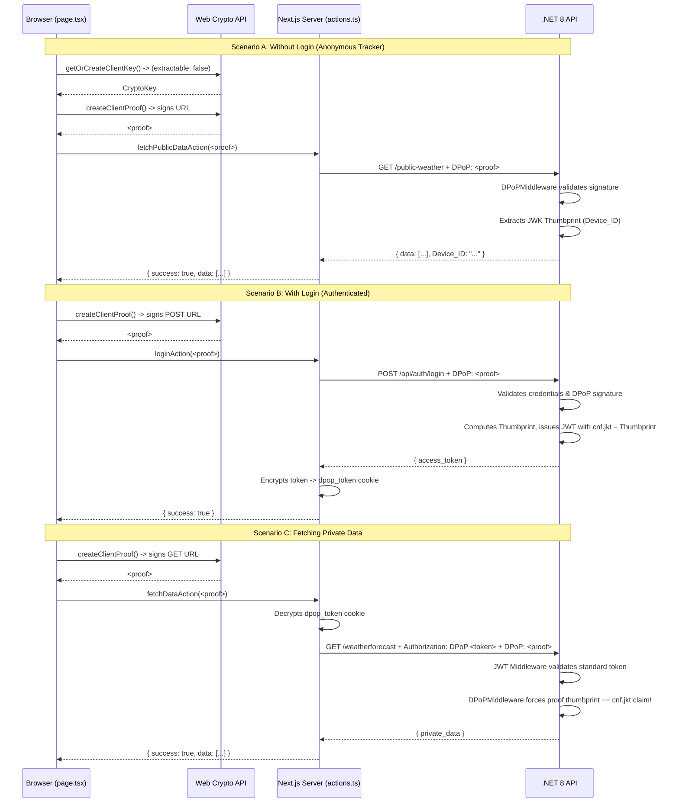

# DPoP Architecture — Code Walkthrough

This document breaks down the exact code implementations that make the Hardware-Bound DPoP and BFF architecture possible. 

---

## 🏗️ Architecture Flow Diagram

Below is the complete sequence of how the Browser natively generates proofs and Next.js acts as the BFF.

---

## 💻 1. The Frontend (Hardware-Bound DPoP)

All cryptographic heavy lifting occurs specifically within the browser using `client-crypto.ts`.

### `client-crypto.ts` — The Browser's Secure Enclave
*   **`getOrCreateClientKey()`**: Uses the browser's native `window.crypto.subtle.generateKey` to create an ECDSA P-256 keypair. Crucially, it sets `extractable: false`. This means the private key physically cannot leave the browser, not even by the user copying it! The key is stored in the browser's local `IndexedDB`.
*   **`createClientProof()`**: Creates the actual `DPoP` JWT signature header. It injects the HTTP method (`htm`) and the URL (`htu`), appending a timestamp (`iat`) and a unique ID (`jti`), and signs it using the non-extractable private key.

### `actions.ts` — The Next.js BFF
This file forces all external API calls to wrap through `backendFetch()`.
*   **`backendFetch()`**: The holy grail of our pattern. It accepts the `clientProof` from the React frontend, attaches the `DPoP` header, and forwards the request to the `.NET` backend.
*   **The Access Token**: The Next.js server still encrypts the `.NET` Access Token and stores it in an `HttpOnly` cookie. This completely prevents Cross-Site Scripting (XSS) from stealing the Access Token.

### `page.tsx` — The UI
The React UI calls `createClientProof()` before triggering any Server Actions. By keeping the private key locked in the browser, but the Access Token locked in the Next.js server, we combine the best of both security models.

---

## 🛡️ 2. The Backend (.NET 8)

The backend never issues raw tokens; it verifies signatures on every single step.

### `AuthController.cs` — The Binding Phase
When a login request hits the server:
1. It validates the user's password.
2. It looks at the incoming `DPoP` header and extracts the user's Public Key.
3. It creates an RFC 7638 standard **Thumbprint** of that Public Key.
4. It mints the Access token (JWT) and adds the critical **`cnf.jkt` claim** matching the thumbprint. 

### `DPoPMiddleware.cs` — The Verification Engine
This acts as a transparent gatekeeper pipeline for every request.
1. **The Parsing:** It intercepts any request heading to a `.RequireAuthorization()` endpoint (and public endpoints optionally).
2. **The Fingerprint Check:** It calculates the Thumbprint from the live `DPoP` header on the current request.
3. **The Matching:** It reads the `cnf.jkt` superglue claim from the Access Token.
4. **The Math:** If the live Thumbprint doesn't match the superglue claim, or the math signature doesn't align with the URL being hit, it flags it as an impersonation attempt.

Instead of crashing or hard-failing (throwing a 401 Unauthorized), the middleware dynamically injects `HttpContext.Items["DPoP_Valid"]` and `HttpContext.Items["DPoP_Thumbprint"]`. This brilliant adjustment ensures that completely **anonymous web traffic** can still be cryptographically tracked per-device via `/public-weather` endpoints, even if no user is technically logged in!
